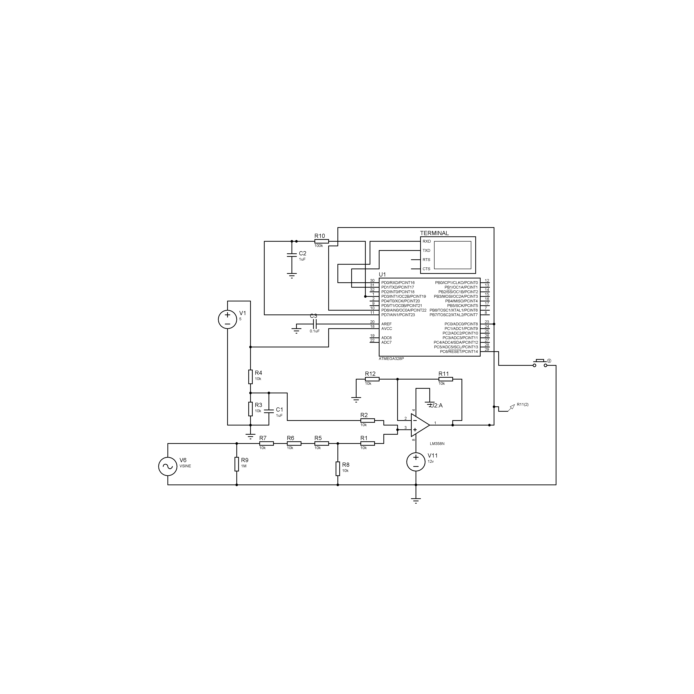

# Oscilloscope- Using Atemga328p 
AVR - Atmega328p oscilloscope at the limit. 150ksps oscilocope with edge triggering writen in AVR-C
### General Features
> * 150ksps 
> * -10v,10v input
> * High impedence input 
## Toolkits 

> * AVR-GCC
> * AVR-G++
> * CMake 3.16
> * Proteus 8.5

## Technologies
> * C for embedded systems

## Deployment with CMAKE

CMAKE requires [cmake 3.16](https://cmake.org/cmake/help/latest/release/3.16.html) to run.

Install the dependencies for UNIX based systems. 
```sh
sudo apt-get install cmake gcc-avr avr-libc uisp avrdude
```
### Cmake 
```sh
cd workidr/debug
cmake ..
make
```

## Features
### ADC
The ADC is set to work in Free running Mode, which means it samples continuously and calls an interrupt when each new sample is ready, every 13.5 ADC clock cycles.
The adc ADC clock speed for 8-bit resolution is 4MHz, a prescaler of 4 with a 16MHz processor clock. 
* Code to config the ADC as metion above:
```c
void init_adc()
{
    cbi(ADCSRA, ADEN); // disable adc
    cbi(ADCSRA, ADSC); // stop conversion

    cbi(ADMUX, REFS1); // choose AVcc with external cap
    sbi(ADMUX, REFS0); // for adc voltage reference
    sbi(ADMUX, ADLAR); // left adjust adc readings for 8 bit
    ADMUX |= ( 0 & 0x07 ); // choose analog 0 pin

    sbi(ADCSRA, ADATE); // enable auto trigger of adc
    sbi(ADCSRA, ADIE); // enable adc interrupt

    cbi(ADCSRA, ADPS2); // set prescaler to 4
    sbi(ADCSRA, ADPS1); //
    cbi(ADCSRA, ADPS0); //

    cbi(ADCSRB, ACME); // choose AIN1 for comparator

    cbi(ADCSRB, ADTS2); // choose free running mode
    cbi(ADCSRB, ADTS1); // for auto trigger adc
    cbi(ADCSRB, ADTS0);
}

void start_adc()
{
    sbi( ADCSRA, ADEN );
    sbi( ADCSRA, ADSC );
}

void stop_adc()
{
    cbi( ADCSRA, ADEN );
    cbi( ADCSRA, ADSC );
}
```

### Comparator
Set the compartor without interruption, ADC interrupt manage the compartor, the comparator's values is read in the ADC interrupt. 
```c
void init_comparator(void)
{
    cbi( ACSR, ACD ); // turn on comparator
    cbi( ACSR, ACBG ); // choose digital pin 7 for comparator
    cbi( ACSR, ACIE ); // disable interrupt

    cbi( ACSR, ACIC ); // disable input capture interrupt
}
```

### ADC Interrupt

The ADC have a circular buffer of 1024 8-bit samples. At each interrupt it checks if the comparator has detected the input voltage above the trigger level eight consecutive times, a simple noise filter, then sets the stop_index which the interrupt will freeze itself at when it hits it, which is the current index plus half the buffer length, so that the trigger event is always at the center of the circular buffer.

```c
ISR(ADC_vect)
{
    adc_data[adc_counter] = ADCH; // read adc
    if (freeze) {
        freeze = false;
        stop_index = -1;
    } else if (adc_counter == stop_index) {
        freeze = true;
    } else if ( comp == 0 && (ACSR & (1 << ACO)) && stop_index < 0) {
        stop_index = ((adc_counter + (ADC_BUFFER_SIZE >> 1) ) & 0x03FF);
    }
    adc_counter = (( adc_counter + 1 ) & 0x03FF); // increment adc counter
    comp = (comp << 1); // push next comparator value
    comp += (ACSR & (1 << ACO));
}
```

###  Trigger Level DAC
The ATMega328 does not have a DAC built-in to set the trigger level, we can use PWM with a low-pass filter. For PWM frequency 490 Hz, I used a 100 kΩ resistor and 1 uF capacitor you can get reasonable delay and ripple in the mV range.

This setup function can be changed the duty cycle, by modifying the OCR2B register.

* This is the code to use PWM on PD3. 
```c
void init_pwm(void)
{
    setOutput(DDRD, PORTD3);
    sbi(TCCR2A, COM2B1);
    sbi(TCCR2A, WGM20);
    sbi(TCCR2B, CS22);
    OCR2B = 128;
}
```

### UART
The UART is configured for 115200 baud
* This is the code to initalize, send, and receibe characters  by  the UART port (rx,tx).
```c
#define BAUD 115200
#include <util/setbaud.h>

void uart_init() {
    UBRR0H = UBRRH_VALUE;
    UBRR0L = UBRRL_VALUE;

#if USE_2X
    UCSR0A |= _BV(U2X0);
#else
    UCSR0A &= ~(_BV(U2X0));
#endif

    UCSR0C = _BV(UCSZ01) | _BV(UCSZ00); // 8 bit
    UCSR0B = _BV(RXEN0) | _BV(TXEN0); // enable rx and tx
}

void uart_putchar(char c) {
    loop_until_bit_is_set(UCSR0A, UDRE0); // wait until reg empty
    UDR0 = c;
}

char uart_getchar() {
    loop_until_bit_is_set(UCSR0A, RXC0); // wait for byte
    return UDR0;
}
```

### Signal conditioning
The ADC operates from 0V to 5V, It needs conditioning circuit, so ciruit uses an op-amp to scale and offset an incoming signal from -10V to 10V to 0V to 5V.
It does this with a divide by four voltage divider and then a voltage adder with a 2.5V input from a voltage divider. All resistors in the schematic are 10kΩ except for R11 with is 1 MΩ to make the scope appear as a high impedence to whatever circuit it is measuring.


## Results

[Proteus8.5 Simulation File](avr-osiclocope.pdsprj)



